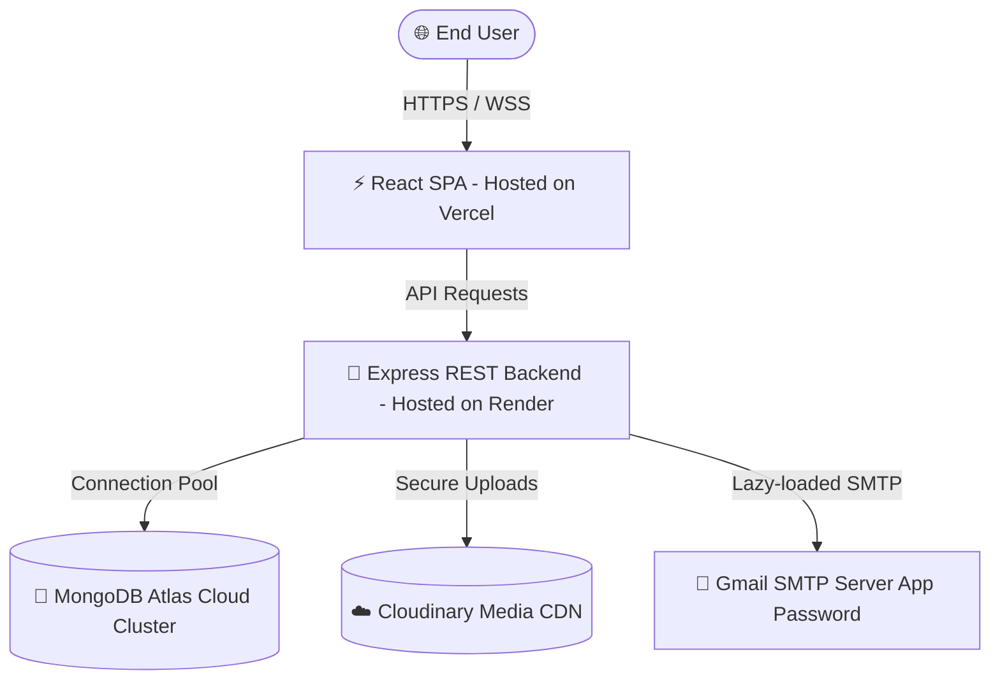

# 🚀 ShaadiSaathi Enterprise Production Deployment Manual

This handbook outlines the exact technical configurations, environment variables, and platform settings required to deploy **ShaadiSaathi** to production using **Vercel** (Frontend) and **Render** (Backend), connected to **MongoDB Atlas** and **Cloudinary** for scalable, enterprise-grade operation.

---

## 🗺️ Architectural Topology



---

## ⚡ 1. Frontend Deployment (Vercel)

### A. Vercel Hosting Parameters
- **Framework Preset**: `Vite` (automatically detected)
- **Root Directory**: `client`
- **Build Command**: `npm run build`
- **Output Directory**: `dist`
- **Install Command**: `npm install`

### B. SPA Routing Config (`vercel.json`)
To prevent `404 Not Found` errors when refreshing sub-pages (e.g. `/dashboard`, `/bookings`), the repository includes a pre-configured `client/vercel.json` file:
```json
{
  "rewrites": [
    {
      "source": "/(.*)",
      "destination": "/index.html"
    }
  ]
}
```

### C. Environment Variables (Vercel Dashboard)
Add these variables in your **Vercel Project Settings → Environment Variables**:

| Variable | Recommended Value | Description |
| :--- | :--- | :--- |
| `VITE_API_URL` | `https://shaadisaathi-3.onrender.com/api` | The public endpoint of your Render Express backend (appended with `/api`). |
| `VITE_SOCKET_URL` | `https://shaadisaathi-3.onrender.com` | The base URL of your Render backend for WebSocket handshakes. |
| `VITE_APP_NAME` | `ShaadiSaathi` | The display name of your marketplace app. |

---

## 🚀 2. Backend Deployment (Render)

### A. Render Service Parameters
- **Service Type**: `Web Service`
- **Runtime**: `Node`
- **Root Directory**: `server`
- **Build Command**: `npm install`
- **Start Command**: `npm start`
- **Auto-Deploy**: `Yes` (bind to your main git branch)

### B. Node Version & Engines
The backend `package.json` specifies Node `20.x` constraints to optimize V8 execution loops on Render VMs:
```json
"engines": {
  "node": "20.x"
}
```

### C. Environment Variables (Render Dashboard)
Add these variables in your **Render Web Service Settings → Environment Variables**:

| Variable | Value Format | Description / Purpose |
| :--- | :--- | :--- |
| `NODE_ENV` | `production` | Enables express production caching and strict CORS restrictions. |
| `PORT` | `10000` | Render injects this port automatically; the backend is ready to bind. |
| `MONGODB_URI` | `mongodb+srv://...` | Connection string to your MongoDB Atlas cluster. |
| `JWT_SECRET` | `[Long-Random-Entropy-Key]` | Secret key used to encrypt and sign authentication tokens. |
| `JWT_EXPIRE` | `7d` | Token lifespan. |
| `JWT_COOKIE_EXPIRE` | `7` | Days the secure HTTP-only cookie remains active in client browser. |
| `CLOUDINARY_CLOUD_NAME` | `dwrgdqrzm` | Cloudinary credentials. |
| `CLOUDINARY_API_KEY` | `687887535217832` | Cloudinary credentials. |
| `CLOUDINARY_API_SECRET` | `Pa-...` | Cloudinary credentials. |
| `EMAIL_SERVICE` | `gmail` | NodeMailer provider preset. |
| `EMAIL_USER` | `n4narendrakr@gmail.com` | Verified SMTP Google Account. |
| `EMAIL_PASS` | `dnheoavebqjohhrc` | **16-character Google App Password** (spaces removed). |
| `EMAIL_FROM` | `ShaadiSaathi <n4narendrakr@gmail.com>`| Outbox display header. |
| `CLIENT_URL` | `https://shaadi-saathi.vercel.app` | **CRITICAL**: The live domain of your Vercel frontend (no trailing slash). |

---

## 🍃 3. MongoDB Atlas Cluster Configuration

### A. IP Access List (Firewall)
1. Go to your **MongoDB Atlas Dashboard**.
2. Navigate to **Network Access**.
3. Render uses dynamic IP ranges. To ensure uninterrupted database connection pooling:
   - Click **Add IP Address** → Choose **Allow Access from Anywhere** (`0.0.0.0/0`).
   - *Alternative (Advance Security)*: Configure Render's static outbound IP addresses if you upgraded to a Render paid tier.

### B. Mongoose Connection Settings
The backend uses a pre-optimized connection pool in `server/index.js` for MongoDB Atlas clusters:
```javascript
await mongoose.connect(mongoUri, {
  serverSelectionTimeoutMS: 10000,
  socketTimeoutMS: 45000,
  connectTimeoutMS: 10000,
  maxPoolSize: 50, // Holds up to 50 concurrent sockets for instant parallel query executions
  retryWrites: true,
  retryReads: true
});
```

---

## ☁️ 4. Cloudinary Media Delivery Optimization

All vendor profile documents, service catalog portfolios, and wedding images are buffered through memory directly into the **Cloudinary CDN**.
- The `multer-storage-cloudinary-v2` storage engine manages instant file uploads.
- The `adminController.js` utilizes compression transformations for assets:
```javascript
const result = await cloudinary.uploader.upload(dataURI, { 
  folder: 'admin_uploads',
  transformation: [
    { quality: 'auto', fetch_format: 'auto' } // Dynamic compression
  ]
});
```

---

## 📧 5. Gmail SMTP & Anti-Spam Gating

The lazy-loaded email transporter verifies connection readiness on server boot. To ensure perfect delivery to inboxes:
1. **Google Account Requirements**:
   - Turn **ON** 2-Step Verification on the Gmail Account (`n4narendrakr@gmail.com`).
   - Go to [Google App Passwords](https://myaccount.google.com/apppasswords).
   - Generate a new App Password for App: `Mail` and Device: `ShaadiSaathi`.
   - Copy the 16-character string. Set it as `EMAIL_PASS` on Render **without any spaces**.
2. **Spam Gating & Warmup**:
   - Run `node smtpTest.js` inside `/server` locally to dispatch a live diagnostic test.
   - If the diagnostic test lands in the **Spam folder**, open the email and click **"Not Spam"**. This trains the Google Spam Filter to deliver future booking and approval notifications directly to users' primary inboxes.

---

## 📡 6. Socket.IO Cross-Origin Integration

The platform enables real-time notification dispatches, vendor updates, and peer-to-peer messaging.
- Render maps both HTTP routes and WebSocket connections to the same deployment.
- The CORS configuration dynamically validates Vercel dynamic preview domains, ensuring secure data handshakes:
```javascript
const isAllowed = allowedOrigins.includes(origin) || 
                  origin.endsWith('.vercel.app') ||
                  /https:\/\/shaadi-saathi(-[a-z0-9-]+)?\.vercel\.app/.test(origin);
```

---

## 🛠️ Production Monitoring & Diagnostics

If you suspect connection issues or routes failing:
1. **Check Live API Health**: Ping `https://<your-backend>.onrender.com/health` in your browser. It should respond with `{"success":true,"message":"Server Healthy"}`.
2. **Test SMTP Delivery**: Hit `https://<your-backend>.onrender.com/api/test-email` from any API client to verify if Gmail is accepting credentials live.
3. **Database Population Logs**: Watch the Render live console logs. The application will log:
   - `✅ MongoDB connected`
   - `✅ Default admin credentials verified and updated.`
   - `✅ SMTP READY — Gmail connection verified successfully.`
